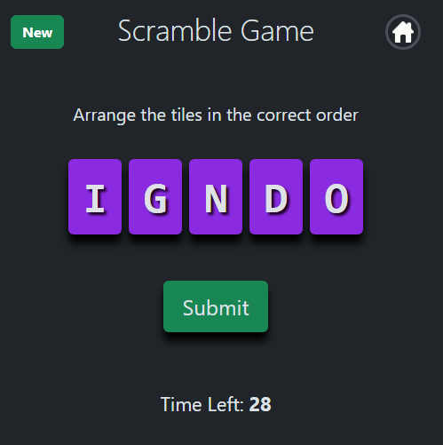
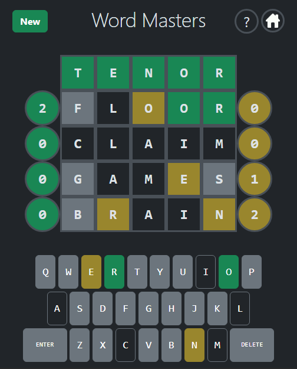
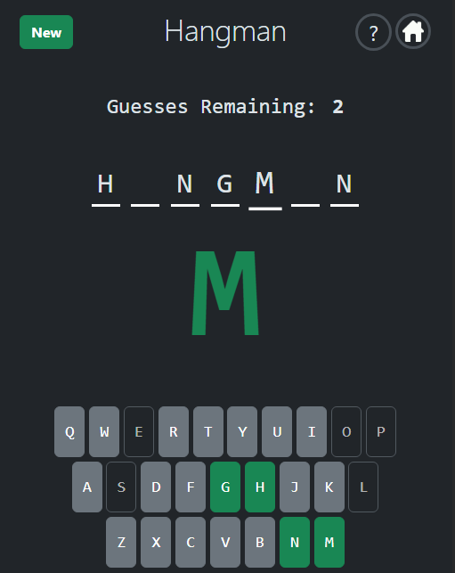
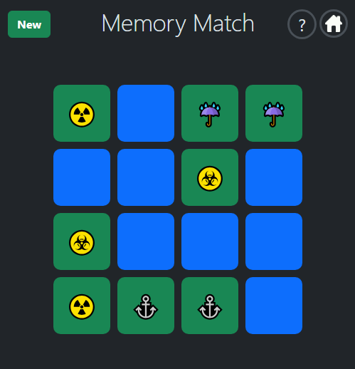

# Brain Games

https://cablej02.github.io/brain-games/

## Description

The motivation behind this project was to create an engaging way to help people improve their vocabulary and word-recognition skills. We wanted to make learning fun while offering a challenging yet lighthearted game that anyone can enjoy.

## Usage

Navigate to each game through the home screen.

### Scramble Game
Drag and drop letters to form the hidden word before time runs out.

### Word Masters
Play Word Masters by guessing five letter words to find the hidden word.  After each guess, you will be informed how many letters were correct(in green on the left), and how many letters were misplaced but still included in the solution word(in yellow on the right). Work to identify which letters in your guess were correct or misplaced.  Keep notes by tapping on letters in guessed words to change their color.

### Hangman
Play Hangman by selecting letters using the onscreen keyboard or your computer's keyboard to try to find the solution word.  Complete the word before you run out of guesses!

### Memory Match
Flip tiles to find and match those with shared symbols.

## Credits

### Collaborators:
- [Nattan Aguia Trujillo](https://github.com/nattanaguiat)
- [Jordan Lorts](https://github.com/JL-Code1)
- [Mauricio Martinez](https://github.com/mauriciomdlg)
- [Jason Cable](https://github.com/cablej02)

### External Libraries Used
- [Bootstrap](https://getbootstrap.com/) - Used for styling, modals, and tooltips
- [Anime.js](https://github.com/juliangarnier/anime) - Used for animation effects.
- [Sortable.js](https://github.com/SortableJS/Sortable) - Used for drag-and-drop sorting functionality.

## Future Development

- Global statistics to track games played, games won, and other metrics for each game
- Different modes and features like dailies, challenge modes, and hints
- Additional artwork and styling